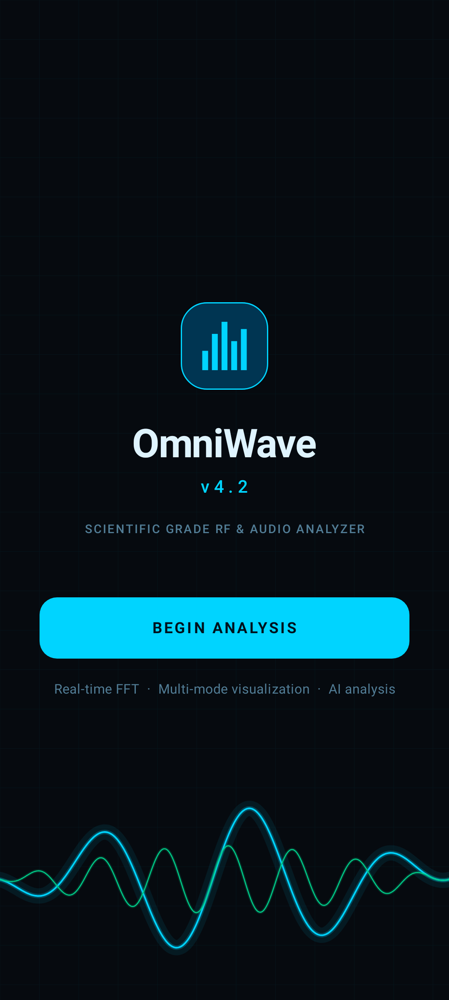
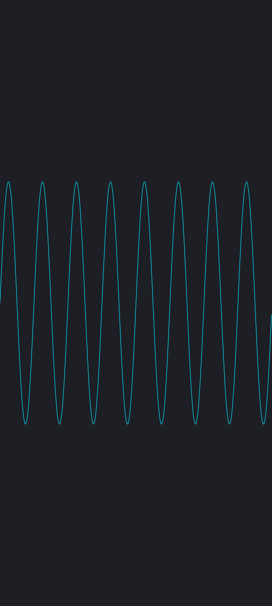

<div align="center">

# 🌊 OmniWave / Wave Analyzer

**Real-time audio & RF spectrum analyzer for Android, built with Jetpack Compose and Kotlin Canvas.**

[](https://github.com/Jacobcdsmith/wave-analyzer/actions/workflows/ci.yml)
[](https://github.com/Jacobcdsmith/wave-analyzer/actions/workflows/deploy.yml)
[](https://kotlinlang.org/)
[](https://developer.android.com/)
[](https://ai.google.dev/)

<p align="center">
  
  
</p>

*Live waveform · 3D waterfall · AI signal classification · RTL-SDR remote*

</div>

---

## ✨ Features

- **7 Visualization Modes**
  - Waveform, Spectrum, 3D Waterfall, SDR Waterfall, IQ Constellation, Radar Spectrum, Phase Space
- **Interactive Spectrum**
  - Pinch-to-zoom and pan frequency axis with reset button and live range readout
  - Frequency / dB grid overlays for precise measurement
- **AI Signal Analysis**
  - One-tap classification of peak spectral features via Google Gemini
- **RTL-SDR Remote**
  - TCP connection to rtl_tcp for real-time RF monitoring
- **Engine Tuning**
  - Adjustable gain, sensitivity, color themes, and audio source
- **On-Device Tone Generator**
  - Self-test with sine, square, sawtooth, or noise — no microphone permission required
- **Dark Scientific UI**
  - Cyan, Ocean, Fire, and Cyberpunk themes

---

## 🏗 Architecture

```
AudioRecord → SpectrumProcessor → FFT → StateFlow → Compose Canvas
                    ↓
              Gemini AI Service
```

| Layer | Responsibility |
|-------|----------------|
| `AudioAnalyzerViewModel` | Audio capture, state coordination, zoom/pan logic |
| `dsp/SpectrumProcessor` | Windowing, FFT, dB conversion, peak-hold, waterfall |
| `dsp/FFT` | In-place Cooley-Tukey transform |
| `ui/visualizations` | 7 Canvas-based composables |
| `ai/AIService` | OkHttp-based Gemini API client |
| `screens/*` | Monitor, Capture, Engine, Remote tabs |

---

## 🚀 Setup

1. **Clone the repo**
   ```bash
   git clone https://github.com/Jacobcdsmith/wave-analyzer.git
   cd wave-analyzer
   ```

2. **Create environment files**
   ```bash
   echo "sdk.dir=C:\\\\Android\\\\Sdk" > local.properties   # or your SDK path
   echo "GEMINI_API_KEY=YOUR_KEY_HERE" > .env
   ```

3. **Generate the Gradle wrapper** (not included in repo)
   ```bash
   gradle wrapper --gradle-version=9.3.1
   ```

4. **Build & test**
   ```bash
   ./gradlew assembleDebug
   ./gradlew test
   ```

> The debug signing config is intentionally empty per project setup. No `google-services.json` is required because the build uses `googleServices.missing.passthrough=true`.

---

## 🧪 Testing

- **Unit tests** for the DSP core (`FFTTest`, `SpectrumProcessorTest`)
- **Robolectric + Roborazzi** screenshot tests for UI baselines
- **GitHub Actions CI** runs `./gradlew test` and `./gradlew assembleDebug` on every push/PR

```bash
./gradlew test                          # all unit tests
./gradlew recordRoborazziDebug          # capture UI baselines
./gradlew verifyRoborazziDebug          # verify against baselines
```

---

## 🚀 Deploy

Push a version tag to trigger the release workflow:

```bash
git tag -a v1.0.0 -m "First release"
git push origin v1.0.0
```

The GitHub Action will build a signed release APK and attach it to a new GitHub Release.

### Required secrets

Go to **Settings > Secrets and variables > Actions** and add:

| Secret | How to generate |
|--------|-----------------|
| `SIGNING_KEY_BASE64` | `base64 -i my-upload-key.jks` |
| `STORE_PASSWORD` | Your keystore password |
| `KEY_PASSWORD` | Your key password |

The release signing config expects the key alias to be `upload`.

## 📡 Roadmap

- [x] Zoom & pan frequency axis
- [x] Frequency / dB grid overlays
- [x] Extract testable `SpectrumProcessor`
- [x] CI pipeline
- [x] On-device tone generator
- [ ] Export captures as PNG / CSV
- [ ] Measurement cursors
- [ ] Max-hold & average trace overlays
- [ ] On-device tone generator for self-test
- [ ] Offline TFLite signal classifier

---

## 🤝 Contributing

This is a personal project, but PRs and ideas are welcome. Open an issue before major changes.

---

## 📄 License

MIT — see [LICENSE](LICENSE) for details.

---

<div align="center">

Made with 💙 and a lot of FFTs.

</div>
